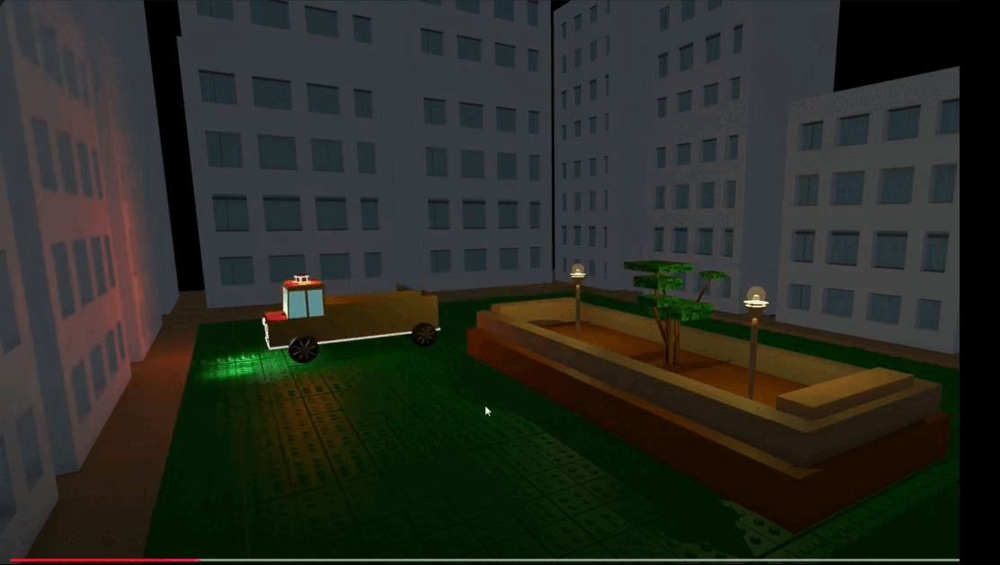
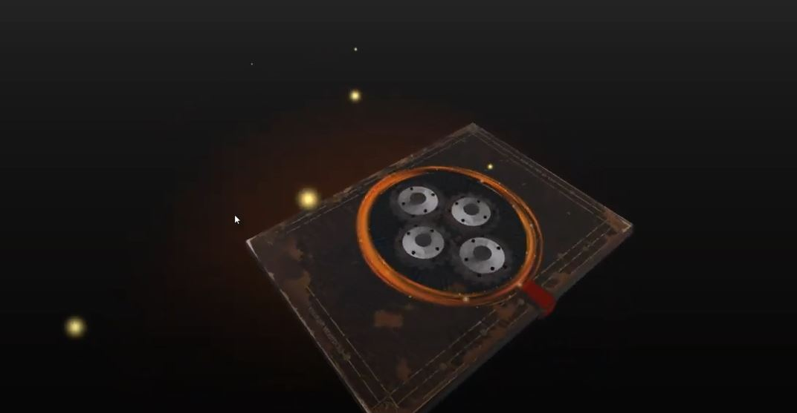
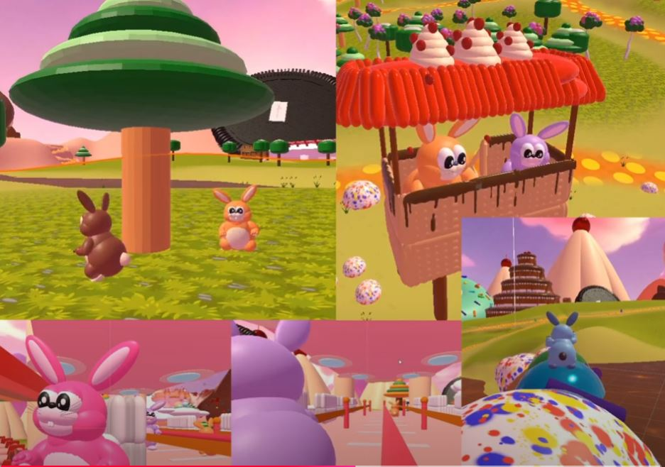

 ## Assignment 20: Build an Interactive Toy
- Create an interactive toy that responds to user inputs from the keyboard and from mouse.
- Use the Input class to detect the keyboard and/or mouse to influence the toy's behavior.
- Make the toy’s behavior creative and visually engaging.

- Push the code to GitHub and upload a short video of your work to the classroom.

## Car ToyVedio 

## Kinetic Sculpture

#### Assignment 19: Build a Kinetic Sculpture
Create a visually kinetic sculpture using the knowledge of Mathf and/or Time and Vector3 and
Transform classes. The sculpture should showcase movement or change over time, creating
smooth, interesting animations. Ensure the sculpture is aesthetic and innovative. Do not forget
to use colors and lights.
Push the code to GitHub and upload a short video of your work to the classroom.

#### Assignment 25: Interactive Pop-Up Box with Interactive Diorama
Create a unique Unity scene using basic Unity 3D shapes, lights, and a simple animated
interactive pop-up box. Your scene should include a mini diorama that tells a very simple
narrative. Use colors intentionally to express the feeling or mood you want to convey in the
scene.

## Assignment 15: Creating an Anamorphic Scene Using Basic Shapes in Unity

#### Create an Anamorphic Scene Using only Basic Shapes in Unity

Objective:
To create visually intriguing scenes by arranging basic shapes in Unity to form an image that only appears correct when viewed from a specific angle, applying anamorphic techniques.

